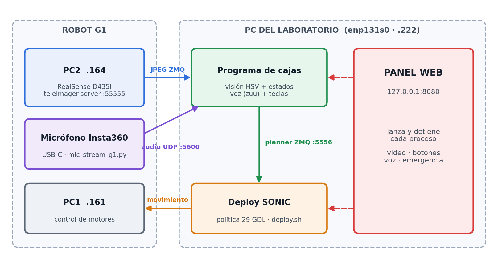
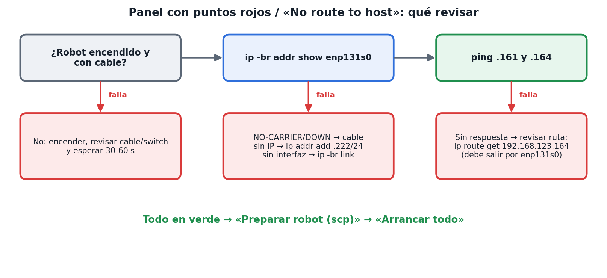
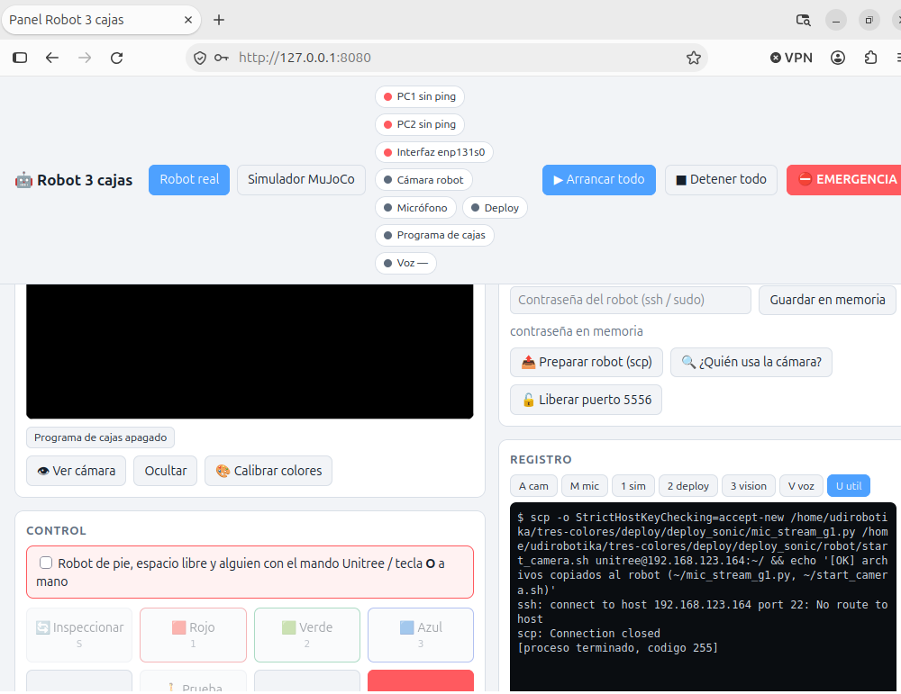
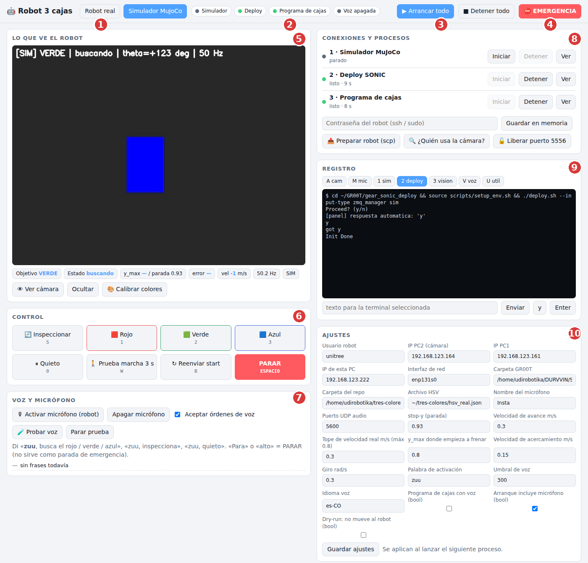
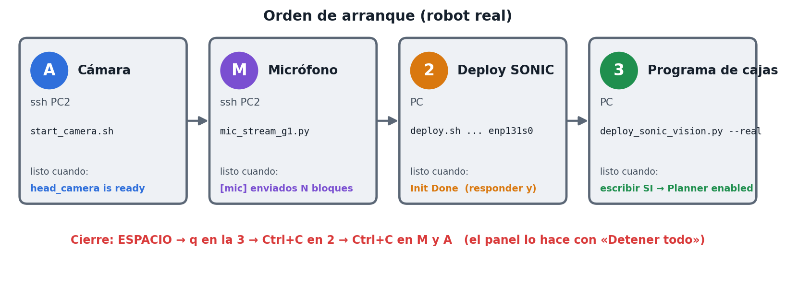
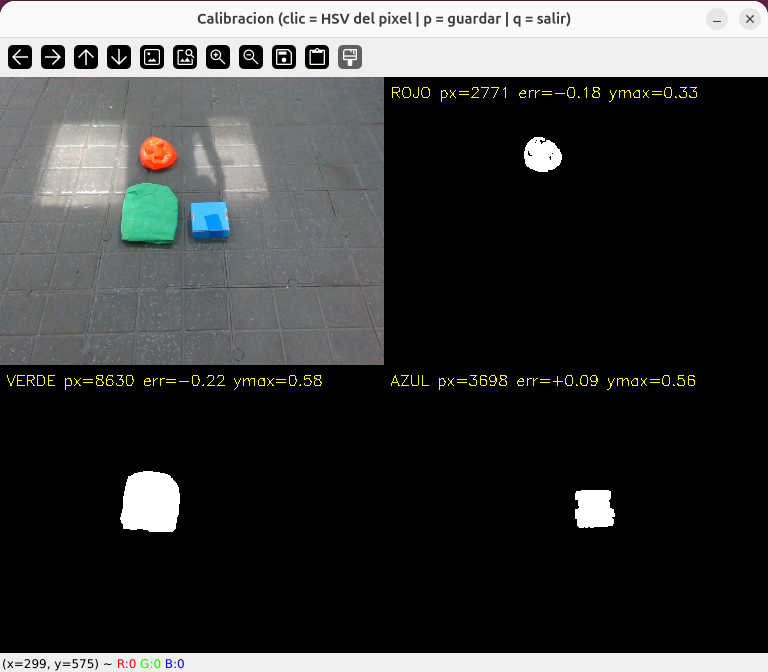
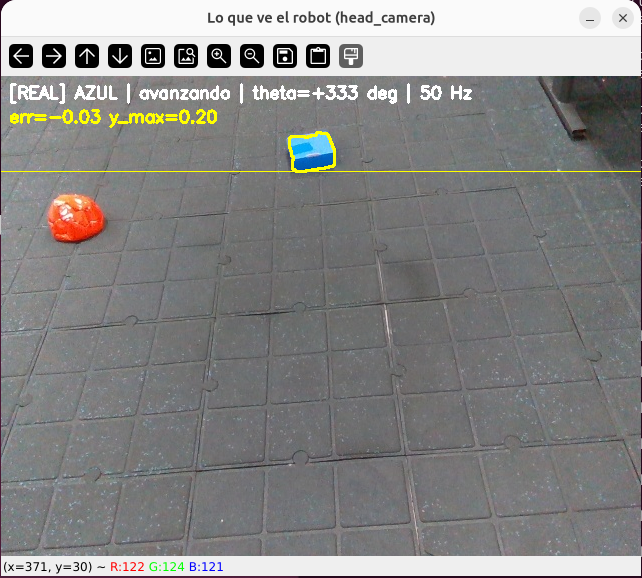
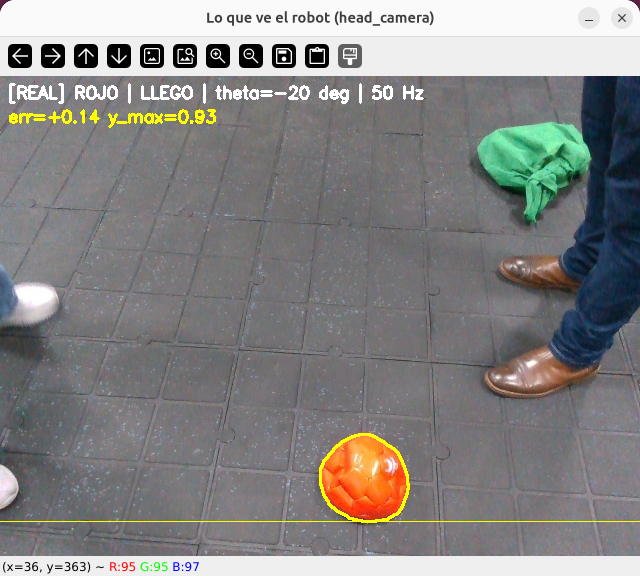
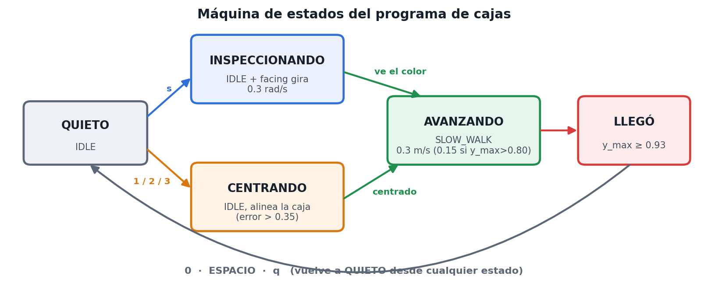
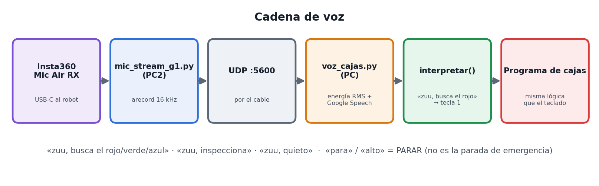

# Runbook ilustrado: Robot 3 cajas con el G1 real (SONIC) y panel de control

*Versión 09/10/2026 · PC del laboratorio `5062robotika` + Unitree G1 de 29 GDL · el robot busca una caja roja, verde o azul, camina hasta ella y se detiene (`y_max = 0.93`). Se puede mandar por teclado, por botones del panel o por voz («zuu»).*

## 1. Cómo está armado



*Figura 1. La cámara y el micrófono viven en el robot y llegan a la PC por el cable. El programa de cajas decide, SONIC camina y el panel web lanza y vigila todo.*

**Seguridad (siempre):** robot de pie con los pies en el piso, espacio libre, una persona con el **mando Unitree** o la tecla **O** del deploy lista. La parada de emergencia real es el mando o la tecla `O`; **la voz y ESPACIO solo detienen el planner**.

## 2. Paso 1: comprobar la red (antes de abrir nada)



*Figura 2. Si el panel muestra PC1, PC2 e Interfaz en rojo, nada de lo demás funciona.*

| Comprobación (en la PC) | Debe verse |
|---|---|
| Robot encendido y con cable (esperar 30–60 s) | — |
| `ip -br addr show enp131s0` | `UP` y `192.168.123.222/24` |
| `ping -c 3 192.168.123.161` y `ping -c 3 192.168.123.164` | respuesta |
| `ip route get 192.168.123.164` | `dev enp131s0` |

Si falta la IP: `sudo ip addr add 192.168.123.222/24 dev enp131s0 && sudo ip link set enp131s0 up`.



*Figura 3. Lo que se ve cuando no hay red: puntos rojos arriba y `ssh: ... No route to host` al pulsar «Preparar robot».*

## 3. Paso 2: abrir el panel

En la PC del laboratorio, en una terminal normal:

```
cd ~/tres-colores && git pull
cd /home/udirobotika/DURVVIN/SIM2SIM/blea/GR00T-WholeBodyControl
source .venv_teleop/bin/activate
python ~/tres-colores/deploy/deploy_sonic/panel_g1.py
```

Abrir `http://127.0.0.1:8080` en el navegador de esa misma PC. Escribir la contraseña del robot en el panel y pulsar **Guardar en memoria** (solo vive en memoria: hay que repetirlo cada vez que se reinicia el panel).



*Figura 4. El panel (captura con una cámara y un deploy de prueba).*

| N.º | Zona | Para qué sirve |
|---|---|---|
| 1 | Modo | **Robot real** o **Simulador MuJoCo** |
| 2 | Luces de estado | Ping a PC1/PC2, interfaz, cámara, micrófono, deploy, programa de cajas, voz |
| 3 | Arrancar todo / Detener todo | Lanza A → M → 2 → 3 en orden, o cierra todo en el orden seguro |
| 4 | EMERGENCIA | ESPACIO al programa de cajas y tecla `O` al deploy |
| 5 | Lo que ve el robot | Video con el objetivo, `y_max`, error, velocidad y Hz |
| 6 | Control | Inspeccionar, Rojo, Verde, Azul, Quieto, Prueba de marcha, Reenviar start, PARAR (también con el teclado) |
| 7 | Voz y micrófono | Activar el micrófono del robot, aceptar o ignorar órdenes de voz, prueba de voz, últimas frases oídas |
| 8 | Conexiones y procesos | Iniciar / Detener / Ver registro de cada terminal; contraseña; scp; liberar cámara y puerto 5556 |
| 9 | Registro | Salida de la terminal seleccionada; casilla para enviar texto (`y`, `SI`…) |
| 10 | Ajustes | IPs, rutas, `stop-y`, velocidades, voz (se guardan en `panel_config.json`) |

## 4. Paso 3: arrancar

La primera vez (o tras actualizar): **Preparar robot (scp)**. Después, con el robot de pie y el mando a mano, marcar la casilla de seguridad y pulsar **Arrancar todo**.



*Figura 5. Cada terminal tiene una señal de «listo». El panel espera esa señal antes de lanzar la siguiente y responde `y` al deploy solo.*

El `SI` del modo real **siempre lo confirmas tú** con el botón del panel; en la terminal del deploy debe aparecer `Planner enabled`.

Si prefieres hacerlo a mano (una terminal por proceso), los comandos están en el runbook de texto (`docs/runbook-3colores-g1-real.md`).

## 5. Paso 4: probar, de menos a más riesgo

1. **Calibrar colores** (nada se envía al robot): botón «Calibrar colores». Las tres máscaras deben marcar cada caja.



*Figura 6. Ventana de calibración con el robot real: cámara y máscaras de rojo, verde y azul con `px`, `err` y `ymax`.*

2. **Prueba de marcha `w`**: camina recto 3 s sin usar la visión. En la terminal del deploy debe salir `Replanning with mode: SLOW_WALK`. Si no camina con `w`, el problema no es la visión ni la voz.
3. **Giro en el sitio** (`s`, Inspeccionar).
4. **Caja a ~1.5 m**: Rojo / Verde / Azul.



*Figura 7. «Lo que ve el robot» en ejecución real: objetivo AZUL, estado «avanzando». La línea blanca es el `y_max` actual de la caja.*



*Figura 8. Llegada: `y_max = 0.93` (línea amarilla) → estado LLEGO y el planner vuelve a IDLE. La parada es la misma para los tres colores.*



*Figura 9. Estados del programa. Girar usa IDLE con la dirección rotando; caminar usa SLOW_WALK (0.1–0.8 m/s).*

## 6. Voz (micrófono Insta360 conectado al robot)



*Figura 10. El micrófono está en el robot; el audio viaja por UDP a la PC, que lo reconoce y lo convierte en la misma tecla que pulsarías.*

- Frases: «zuu, busca el rojo / verde / azul», «zuu, inspecciona», «zuu, quieto». «Para» o «alto» = PARAR (no necesita «zuu»).
- El transmisor inalámbrico del Insta360 debe estar encendido y emparejado. El reconocimiento necesita internet (Google).
- El ruido de los motores entra en el audio: hablar cerca del robot. En el panel, «Aceptar órdenes de voz» las activa o ignora sin reiniciar nada.
- **No usar «Probar voz» a la vez que el programa de cajas con voz** (comparten el puerto UDP 5600).

## 7. Velocidad

| Situación | Valor |
|---|---|
| Avance hacia la caja | **0.3 m/s** (ajuste «Velocidad de avance») |
| Acercamiento (`y_max > 0.80`) | 0.15 m/s |
| Prueba `w` | 0.3 m/s durante 3 s |
| Giro al inspeccionar | 0.3 rad/s |
| Tope en modo real | 0.3 m/s (se sube con «Tope de velocidad real» / `--max-walk`, máx. 0.8) |

Subir por pasos, con el mando en la mano, probando cada paso primero con `w` y luego con la caja:

| Paso | Avance y tope (m/s) | `slow-y` | Acercamiento (m/s) |
|---|---|---|---|
| 0 (actual) | 0.3 | 0.80 | 0.15 |
| 1 | 0.4 | 0.75 | 0.20 |
| 2 | 0.5 | 0.70 | 0.20 |
| 3 | 0.6 o más | 0.65 | 0.25 |

A más velocidad el robot necesita más distancia para frenar: bajar `slow-y`. Si zigzaguea, volver al paso anterior.

## 8. Detener todo

1. **ESPACIO** (o PARAR) en el panel: el robot queda quieto. Emergencia real: mando Unitree o tecla `O`.
2. **q** en el programa de cajas.
3. **Ctrl+C** en el deploy; esperar el prompt.
4. **Ctrl+C** en el emisor de audio; apagar el transmisor del Insta360.
5. **Ctrl+C** en la cámara. Si queda colgada: `sudo pkill -9 -f teleimager-server`.
6. Robot sentado o en arnés.

El botón **Detener todo** del panel hace estos pasos en ese orden. Antes de relanzar: puerto 5556 libre y `/dev/video*` libre (botones «Liberar puerto 5556» y «¿Quién usa la cámara?»).

## 9. Problemas frecuentes

| Síntoma | Causa | Solución |
|---|---|---|
| PC1/PC2/Interfaz en rojo; `No route to host` | Sin enlace con el robot | Paso 1 (figura 2) |
| El registro de A/M se queda en el aviso «post-quantum» | El robot espera la contraseña y el panel no la tiene | Escribirla en el panel y **Guardar**: se envía sola |
| `teleimager-server: command not found` | ssh no interactivo no carga `~/.bashrc` | Ya corregido: `git pull` y reiniciar el panel |
| `Device or resource busy` / `uvcvideo is in use` | `videohub_pc4` u otro proceso usa la cámara | `start_camera.sh` v2 lo libera; si persiste, «¿Quién usa la cámara?» |
| `Address already in use` en 5556 | Pico manager, app LSC u otra copia abierta | «Liberar puerto 5556» |
| `Lost LowState` en el deploy | Se perdió la red con el robot | Paso 1 y reiniciar el deploy |
| «Lo que ve el robot» dice «avanzando» pero el robot no se mueve | El deploy murió o `--dry-run` activo | Revisar el registro del deploy; probar `w`; quitar «Dry-run» en Ajustes |
| La voz no oye nada | Micrófono M apagado o transmisor apagado | «Activar micrófono (robot)» y encender el transmisor |

## 10. Estado del proyecto

**Hecho:** programa de las 3 cajas en MuJoCo (29 GDL); cámara RealSense del robot a la PC (30 fps); colores calibrados con el robot real; parada unificada `y_max = 0.93`; `start_camera.sh` v2; voz con Insta360 (prueba aislada); panel web probado con procesos simulados; runbooks y GitHub al día.

**Pendiente en el robot real:** confirmar que `SLOW_WALK` camina estable (tecla `w`); llegar a la caja y medir la distancia real de parada con cinta; voz integrada con el robot (precisión de «zuu», ruido de motores, latencia); panel completo con el robot real.

*Repositorios: `tres-colores` y `MANIPULACION-UNITREE-G1` (carpeta `deploy/deploy_sonic/`, runbook de texto en `docs/`).*
